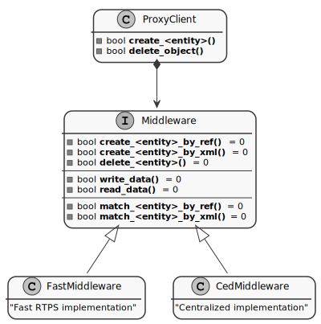

.. |br| raw:: html

  <br/>

.. _micro_xrce_dds_agent_label:

eProsima Micro XRCE-DDS Agent
=============================

The *eProsima Micro XRCE-DDS Agent* acts as a server between the DDS Network and *eProsima Micro XRCE-DDS Clients* applications.
The *Agents* receive messages containing operations from the *Clients*, and keep track of the *Clients* and of the entities they
create.
These entities are used by the *Agents* to interact with the DDS Global Data Space on behalf of the *Clients*.

The communication between a *Client* and an *Agent* currently supports UDP, TCP, Serial, CAN FD, and Custom transports, depending
on the peripherals and communication technologies offered by the platforms.
A section dedicated to the configuration and use of the Custom Transport can be found
at the end of this :ref:`page <custom_transport_agent>`.

While running, the *Agent* attends any received requests from the *Clients* and answers back with the result of those requests.

This section is organized as follow:

- :ref:`agent_cli`
- :ref:`custom_transport_agent`
- :ref:`agent_configuration`
- :ref:`creation_mode_agent`
- :ref:`middleware_abstraction_layer`

.. _agent_cli:

Agent CLI
---------

To run the *Agent*, first of all build it as indicated in the :ref:`installation_label` page.
Once it is built successfully, launch it by executing one of the following commands:

UDP transport
    The communication via UDP can be executed using two modes, IPv4 and IPv6; and configured as follows: ::

        $ ./MicroXRCEAgent [ udp4 | udp6 ]  [OPTIONS]

        Options:
          -h,--help                                    Print the help message.
          -p,--port UINT REQUIRED                      Select the IP port.
          -m,--middleware TEXT in {ced,rtps,dds}=dds   Select the kind of middleware among the supported ones. By default, it will be FastDDS.
          -r,--refs FILEPATH                           Load a references file from the given path.
          -v,--verbose UINT in {0,1,2,3,4,5,6}=4       Select log level from none (0) to full verbosity (6).
          -d,--discovery UINT=7400                     Activate the Discovery server. If no port is specified, 7400 will be used.
          --p2p UINT                                   Activate the P2P profile, using the given port.

TCP transport
    The communication via TCP can be executed using two modes, IPv4 and IPv6; and configured as follows: ::

        $ ./MicroXRCEAgent [ tcp4 | tcp6 ] [OPTIONS]

        Options:
          -h,--help                                    Print the help message.
          -p,--port UINT REQUIRED                      Select the IP port.
          -m,--middleware TEXT in {ced,rtps,dds}=dds   Select the kind of middleware among the supported ones. By default, it will be FastDDS.
          -r,--refs FILEPATH                           Load a references file from the given path.
          -v,--verbose UINT in {0,1,2,3,4,5,6}=4       Select log level from none (0) to full verbosity (6).
          -d,--discovery UINT=7400                     Activate the Discovery server. If no port is specified, 7400 will be used.
          --p2p UINT                                   Activate the P2P profile, using the given port.

Communication via Serial transport (only Linux)
    The communication via Serial transport can be executed and configured as follows: ::

        $ ./MicroXRCEAgent serial [OPTIONS]

        Options:
          -h,--help                                    Print the help message.
          -D,--dev FILE REQUIRED                       Specify the serial device.
          -f,--file FILE REQUIRED                      Specify a text file with the serial device name.
          -b,--baudrate TEXT=115200                    Select the baudrate.
          -m,--middleware TEXT in {ced,rtps,dds}=dds   Select the kind of middleware among the supported ones. By default, it will be FastDDS.
          -r,--refs FILEPATH                           Load a references file from the given path.
          -v,--verbose UINT in {0,1,2,3,4,5,6}=4       Select log level from none (0) to full verbosity (6).

.. note::
    The *Agent* will check and wait for the proper availability of the Serial port to start the connection.
    Its expected to start the transport with a disconnected Serial port.

Communication via Multiserial transport (only Linux)
    This transport allows multiple serial connections on the same *Agent* instance.
    The communication via Multiserial transport can be executed and configured as follows: ::

        $ ./MicroXRCEAgent multiserial [OPTIONS]

        Options:
          -h,--help                                    Print the help message.
          -D,--devs FILE REQUIRED                      Specify the serial devices.
          -f,--file FILE REQUIRED                      Specify a text file with one serial device per line.
          -b,--baudrate TEXT=115200                    Select the baudrate.
          -m,--middleware TEXT in {ced,rtps,dds}=dds   Select the kind of middleware among the supported ones. By default, it will be FastDDS.
          -r,--refs FILEPATH                           Load a references file from the given path.
          -v,--verbose UINT in {0,1,2,3,4,5,6}=4       Select log level from none (0) to full verbosity (6).

.. note::
    The *Agent* will check and wait for the proper availability of each Serial port to start the connection.  
    Its expected to start the transport with multiple disconnected ports.

Communication via CAN FD transport (only Linux)
    The communication via CAN FD transport can be executed and configured as follows: ::

        $ ./MicroXRCEAgent canfd [OPTIONS]

        Options:
          -h,--help                                    Print the help message.
          -D,--dev INTERFACE REQUIRED                  Specify the CAN interface.
          -m,--middleware TEXT in {ced,rtps,dds}=dds   Select the kind of middleware among the supported ones. By default, it will be FastDDS.
          -r,--refs FILEPATH                           Load a references file from the given path.
          -v,--verbose UINT in {0,1,2,3,4,5,6}=4       Select log level from none (0) to full verbosity (6).

.. note::
    The used interface must support CAN FD frames with a maximum payload of 64 bytes.
    The agent will use the received message identifiers from each client on its output frames.

Communication via pseudo terminal (only Linux)
    The communication via pseudo serial can be executed and configured as follow: ::

        $ ./MicroXRCEAgent pseudoterminal [OPTIONS]

        Options:
          -h,--help                                    Print the help message.
          -D,--dev FILE REQUIRED                       Specify the pseudo serial device.
          -b,--baudrate TEXT=115200                    Select the baudrate.
          -m,--middleware TEXT in {ced,rtps,dds}=dds   Select the kind of middleware among the supported ones. By default, it will be FastDDS.
          -r,--refs FILEPATH                           Load a references file from the given path.
          -v,--verbose UINT in {0,1,2,3,4,5,6}=4       Select log level from none (0) to full verbosity (6).

* The reference file shall be composed by a set of Fast DDS profiles following the
  `XML syntax <https://fast-dds.docs.eprosima.com/en/latest/fastdds/xml_configuration/xml_configuration.html>`_
  described in
  the *eProsima Fast DDS* `documentation <https://fast-dds.docs.eprosima.com/en/latest/>`_.
  The :code:`profile_name` attribute of each profile represents a reference to an XRCE entity, so that it can be
  used by the *Clients* to create entities by reference.
* The :code:`-b,--baudrate <baudrate>` options sets the baud rate of the communication. It can take the following values:
  0, 50, 75, 110, 134, 150, 200, 300, 600, 1200, 1800, 240, 4800, 9600, 19200, 38400, 57600, 115200 (default),
  230400, 460800, 500000, 576000, 921600, 1000000, 1152000, 1500000, 2000000, 2500000, 3000000, 3500000 or 4000000 bauds.
* The :code:`-v,--verbose <level[0-6]>` option sets log level from less to more verbose, where level 0 corresponds to the logger being off.
  Then, from 1 to 6, the following logging levels are activated: *critical*, *error*, *warning*, *info*, *debug* and *trace*.
* The option :code:`-m,--middleware <middleware-impl>` sets the middleware implementation to use.
  There are three: RTPS (based on eProsima Fast RTPS), DDS (specified by the XRCE standard and using Fast DDS) and Centralized (topic are managed by the Agent similarly to MQTT).
  More information about the supported middlewares can be found :ref:`here <middleware_abstraction_layer>`.
* The ``--p2p <port>`` option enables P2P communication, this option is only available on network transports. Centralized middleware is necessary for this option.

.. _custom_transport_agent:

Custom transport
----------------

If none of the transports specified above is suitable for the target application, users can easily create an instance of a *Micro XRCE-DDS Agent*, together with a custom transport implementation.

For this purpose, the ``eprosima::uxr::CustomAgent`` class was developed. It follows the policy of giving users function signatures to implement, which hide as much as possible the underneath implementation details of the *Agent*.
Thus, this methods provide common parameters used when implementing a receive/send message method, such as an octet pointer to a raw data buffer, buffer/message length, timeout, and so on.

More details on how to implement a custom transport can be found in the :ref:`custom_transport` Agent's section of this documentation.

.. _agent_configuration:

Configuration
-------------

There are several parameters which can be set at **compile-time** to configure the *eProsima Micro XRCE-DDS Agent*.
These parameters can be selected as CMake flags (:code:`-D<parameter>=<value>`) before the compilation.
The following is a table listing these parameters and the functionalities they carry out:

.. list-table::
    :header-rows: 1

    *   - Definition
        - Description
        - Values
        - Default
    *   - :code:`UAGENT_CONFIG_RELIABLE_STREAM_DEPTH`
        - Specifies the history of the reliable streams.
        - :code:`<number>`
        - :code:`16`
    *    - :code:`UAGENT_CONFIG_BEST_EFFORT_STREAM_DEPTH`
         - Specifies the history of the best-effort streams.
         - :code:`<number>`
         - :code:`16`
    *    - :code:`UAGENT_CONFIG_HEARTBEAT_PERIOD`
         - Specifies the :code:`HEARTBEAT` message period in millisecond.
         - :code:`<number>`
         - :code:`200` 
    *    - :code:`UAGENT_CONFIG_TCP_MAX_CONNECTIONS`
         - Specifies the maximum number of connections that the *Agent* can manage.
         - :code:`<number>`
         - :code:`100` 
    *    - :code:`UAGENT_CONFIG_TCP_MAX_BACKLOG_CONNECTIONS`
         - Specifies the maximum number of incoming connections (pending to be |br| established) that the *Agent* can manage.
         - :code:`<number>`
         - :code:`100`
    *    - :code:`UAGENT_CONFIG_SERVER_QUEUE_MAX_SIZE`
         - Maximum server's queues size.
         - :code:`<number>`
         - :code:`32000`
    *    - :code:`UAGENT_CONFIG_CLIENT_DEAD_TIME`
         - Client dead time in milliseconds.
         - :code:`<number>`
         - :code:`30000`
    *    - :code:`UAGENT_SERVER_BUFFER_SIZE`
         - Server buffer size.
         - :code:`<number>`
         - :code:`65535`

.. _agent_configuration_domain_id:

Domain ID
^^^^^^^^^

The Domain ID of the entities created by the Agent can be configured at runtime with the environment variable ``XRCE_DOMAIN_ID_OVERRIDE``.

To allow this override, the *Client* shall use the reserved Domain ID value ``255`` when the participant is created.

.. _creation_mode_agent:

Creation Mode: Agent
--------------------

As explained in the :ref:`creation_mode_client` section in the :ref:`micro_xrce_dds_client_label` page, the creation of :ref:`entities_label` on the *Agent* can be done in two ways: by XML, or by reference.
While the creation by XML is configured directly on the *Client*, creation by reference must be configured on the *Agent*, via
an ``agent.refs`` file which must be loaded as a CLI parameter by using the
``-r`` option followed by the path to the reference file. If a Custom trasnport is used, the ``agent.refs`` file must be fed to the
:ref:```load_config_file`` <load_config_file>` function defined in the *Agent*.

The ``agent.refs`` file should define the desired profiles as follows:

.. code-block:: cpp

    <profiles>
        <participant profile_name="default_xrce_participant">
            <rtps>
                <name>default_xrce_participant</name>
            </rtps>
        </participant>
        <data_writer profile_name="shapetype_data_writer">
            <topic>
                <kind>WITH_KEY</kind>
                <name>Square</name>
                <dataType>ShapeType</dataType>
            </topic>
        </data_writer>
        <data_reader profile_name="shapetype_data_reader">
            <topic>
                <kind>WITH_KEY</kind>
                <name>Square</name>
                <dataType>ShapeType</dataType>
            </topic>
        </data_reader>
        <topic profile_name="shapetype_topic">
            <kind>WITH_KEY</kind>
            <name>Square</name>
            <dataType>ShapeType</dataType>
        </topic>
        <requester profile_name="shapetype_requester"
                  service_name="shapetype_service"
                  request_type="request_type"
                  reply_type="reply_type">
        </requester>
        <replier profile_name="shapetype_replier"
                service_name="shapetype_service"
                request_type="request_type"
                reply_type="reply_type">
        </replier>
    </profiles>

In the reference file, each entity must be associated to a ``profile_name`` which serves as a label to which the *Client* can refere
when creating entities.

.. _middleware_abstraction_layer:

Middleware Abstraction Layer
----------------------------

The Middleware Abstraction Layer is an interface whose purpose is to isolate the XRCE core from the middleware,
as well as to allow providing multiple middleware implementations.
The interface has a set of pure virtual functions, which are called by the `ProxyClient` each time a *Client*
requests to create/delete an entity or to write/read data.



For the moment, the *Agent* counts with two active middleware implementations (*FastDDSMiddleware* and *CedMiddleware*)
and another one that is currently deprecated (*FastMiddleware*).

FastDDSMiddleware
^^^^^^^^^^^^^^^^^

The *FastDDSMiddleware* uses *eProsima Fast DDS*, a C++ implementation of the DDS standard.

This middleware allows the *Clients* to produce and consume data in the DDS Global Data Space, and as such also in the
ROS 2 ecosystem.
The *Agent* has the behaviour described in the *DDS-XRCE* standard, that is, for each *DDS-XRCE*
entity a DDS proxy entity is created, and the writing/reading action produces a publishing/subscribing operation in the DDS world.

.. _ced_middleware_label:

CedMiddleware
^^^^^^^^^^^^^

The *CedMiddleware* (Centralized Middleware) works similar to MQTT, that is, the *Agent* acts as a broker
but has no output to the DDS world. It:

* Accepts connection from the *Clients*,
* Accepts messages published by the *Clients*,
* Processes *subscribe* and *unsubscribe* requests from the *Clients*,
* Forwards messages that match the *Clients*' subscriptions,
* Closes the connection opened by the *Clients*.
 
By default, this middleware does not allow communication between *Clients* connected to different *Agents*,
but the :ref:`P2P communication <p2p_communication_label>` enables this feature.

FastMiddleware
^^^^^^^^^^^^^^

The *FastMiddleware* uses *eProsima Fast RTPS*, a C++ implementation of the RTPS (Real Time Publish Subscribe) protocol.
This middleware allows *Client* to produce and consume data in the DDS Global Data Space, and as such also in the
ROS 2 ecosystem.
As in the case of the *FastDDSMiddleware*, the *Agent* has the behaviour described in the *DDS-XRCE* standard, that is, for each *DDS-XRCE*
entity a DDS proxy entity is created, and the writing/reading action produces a publishing/subscribing operation in the DDS world.

.. warning::
    
    This implementation is deprecated at the moment.

How to add a middleware
^^^^^^^^^^^^^^^^^^^^^^^

Adding a new middleware implementation is quite simple, if the steps below are followed:

#. Create a class that implement the `Middleware` class (see *inclue/uxr/agent/middleware/fast/FastMiddleware.hpp* and
   *src/cpp/middleware/fast.cpp* as examples).
#. Add a `enum` member protected by defines in `Middleware::Kind` at *include/uxr/agent/middleware/Middleware.hpp*.
#. Add a case in the switch of the `ProxyClient` constructor at *src/cpp/client/ProxyClient.cpp*.
#. In *CMakeLists.txt* add an option similar to `UAGENT_FAST_PROFILE` and add the source to `SRCS` variable.
#. In *include/uxr/agent/config.hpp.in* add a `#cmakedefine` with the name of the CMake option.
#. Finally, add the CLI middleware option in `MiddlewareOpt` constructor at *include/uxr/agent/utils/CLI.hpp*.
