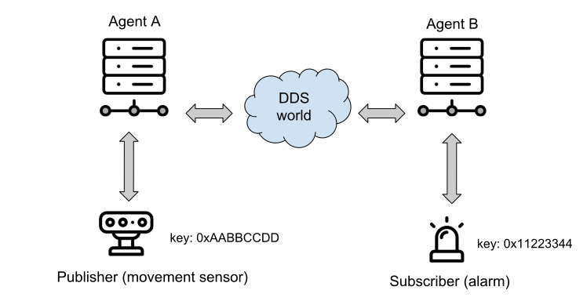
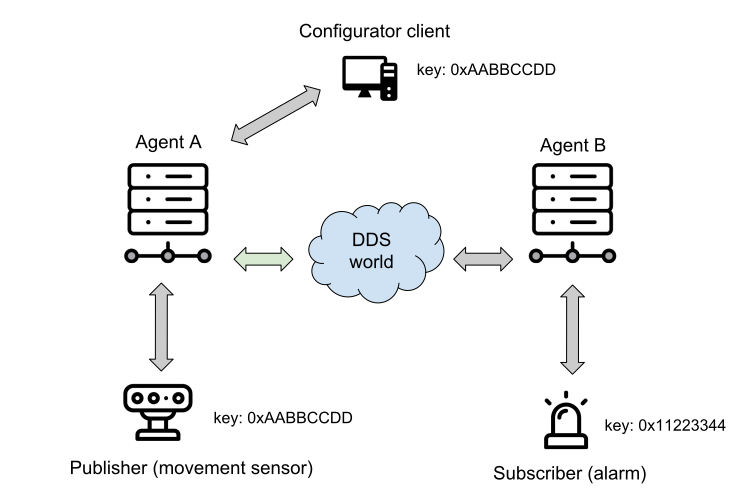
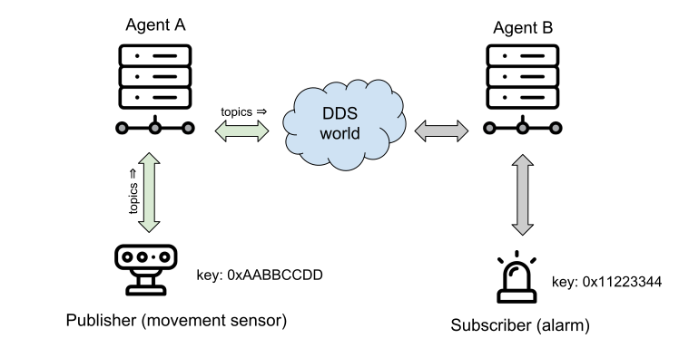
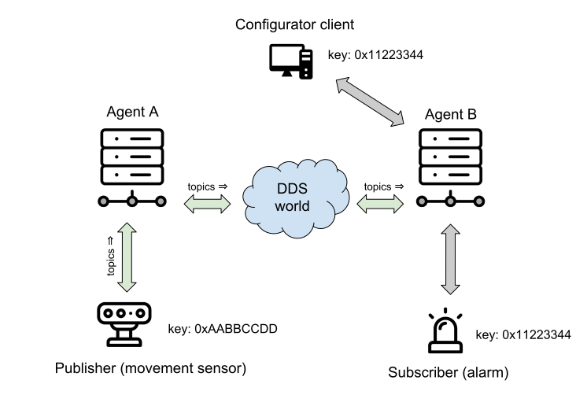
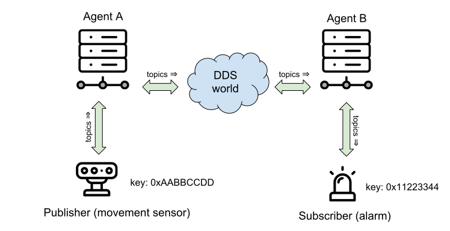

.. _deployment_label:

Deployment example
==================

This part will show how to deploy a system using *Micro RTPS* in a real enviroment.
An example of this, can be found into ``examples/Deployment`` folder.

Previous tutorials are based in `all in one` examples, that is, examples that create entities, publish or subscribe and then delete the resources.
A possible real purpose of this, consists in differentiate the logic of `creating entities` and the actions of `publishing and subscribing`.
This can be done creating two differents clients.
One for configurating the entities in the agent, and run possibly only once.
And other/s, that logs in with the same session as the configure client (sharing the entities) and only publishes or subscribes data.

This way allow to create easy clients in production only with te purpose of send and receive data.
Related to it, exists the concept of `profile` that allow to build the client library only with the behavior choosen.
See :ref:`micro_rtps_client_label` for more information about this.

The following shows an example about how to configure the enviroment using a `configurator client`.

The enviroment contains two agents (is perfectly possible to use only one agent too), and two clients, one for publishing and other subscribing.

The agent `A` is started (or could be already started and working with another clients).
In this state a `configurator client` is connected to this agent with the `client key` that will be used by the future `publisher client` (0xAABBCCDD)
Once a session is logged in, the `configurator client` creates the necesary entities for the `publisher client`.
This implies the creation of `participant`, `topic`, `publisher`, and `datawriter` entities.
These entities have a representation as DDS entities, and can be reached now from the DDS world.
That implies that a possible `subscriber DDS entity` could be already listening topics if it match with a `publisher DDS entity` through `DDS` world.

The `publisher client` is connected to the agent.
This client logs in session with its client key (0xAABBCCDD).
In that moment, it can use all entities created related to this `client key`.
Because all entities that it use was created successful by the `configurator client`, the `publisher client` can inmediately publish to `DDS`.

The `configurator client` connects and logs in to another agent `B`, now with the subscriber's key (0x11223344).
In this case, the entities that the `configurator client` creates are a `participant`, a `topic`, a `subscriber`, and a `datareader`.

The `subscriber client` logs in to the agent.
As all their entities have been created previously, it only need to configure the read after log in.
Once the message of request data has been sent, the subscriber will receive the topics from the publisher through `DDS` world.

The entities created by the `configuraton client` will be available until the session is deleted.
