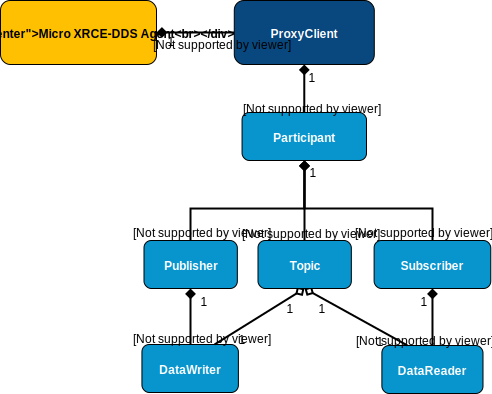

.. _entities_label:

Entities
========

The protocol under *Micro RTPS* (XRCE), defines entities that have a direct correspondence with their analogous actor on *Fast RTPS* (DDS).
The entities manage the communication between *Micro RTPS Client* and the DDS Global Data Space.
Entities are stored in the *Micro RTPS Agent* and the *Micro RTPS Client* can create, use and destroy these entities.

The entities are uniquely identified by an ID called `Object ID`. `Object ID` is the way a *Client* refers to them inside an Agent.
In most of the *Client* requests operations is necessary to specify an ID referring to one of the *Client* entities stored in the *Agent*.

Type of Entities
----------------
These are the entities that the *Client* can interact with.

Participants
    Participants can hold any number of Publishers and/or Subscribers

Publisher
    Publishers can hold any number of data readers.

Subscriber
    Subscribers can hold any number of data readers.

Topic
    Topic data is the base of the communication. A Topic is composed of a name and a data type.

DataWriter
    This is the endpoint able to write Topic data.

DataReader
    This is the endpoint able to read Topic data.

This figure shows the entities hierarchy

