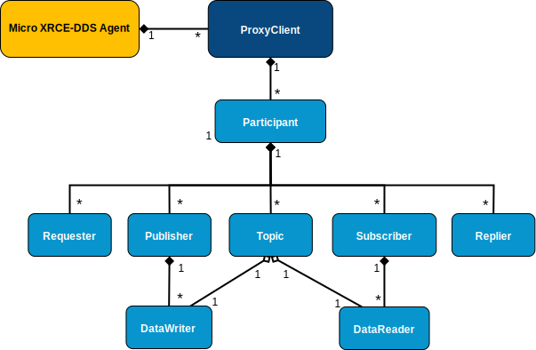

.. _getting_started_label:

Getting started
===============
This page shows how to get started with the *eProsima Micro XRCE-DDS Client* development.
We will create a *Client* that can publish and subscribe to a topic.
This tutorial has been extracted from the examples found into ``examples/PublisherHelloWorld`` and ``examples/SubscriberHelloWorld``.

First, we need to have on the system:

 - :ref:`micro_xrce_dds_client_label`.
 - :ref:`micro_xrce_dds_agent_label`.
 - :ref:`microxrceddsgen_label`.

Generate from the IDL
^^^^^^^^^^^^^^^^^^^^^^
We will use HelloWorld as our Topic whose IDL is the following: ::

    struct HelloWorld
    {
        unsigned long index;
        string message;
    };

In the *Client* we need to create an equivalent C type with its serialization/deserialization code.
This is done automatically by :ref:`microxrceddsgen_label`: ::

    $ microxrceddsgen HelloWorld.idl

Initialize a Session
^^^^^^^^^^^^^^^^^^^^
In the source example file, we include the generated type code, to have access to its serialization/deserialization functions along to the writing function.
Also, we will specify the max buffer for the streams and its historical associated for the reliable streams.

.. code-block:: C

    #include "HelloWorldWriter.h"

    #define STREAM_HISTORY  8
    #define BUFFER_SIZE     UXR_CONFIG_UDP_TRANSPORT_MTU * STREAM_HISTORY

Before create a Session we need to indicate the transport to use (the *Agent* must be configured for listening from UDP at port 2018).

.. code-block:: C

    uxrUDPTransport transport;
    if (!uxr_init_udp_transport(&transport, UXR_IPv4, "127.0.0.1", "2018"))
    {
        printf("Error at create transport.\n");
        return 1;
    }

Next, we will create a session that allows us interacting with the *Agent*:

.. code-block:: C

    uxrSession session;
    uxr_init_session(&session, &transport.comm, 0xABCDABCD);
    uxr_set_topic_callback(&session, on_topic, NULL);
    if(!uxr_create_session(&session))
    {
        printf("Error at create session.\n");
        return 1;
    }

The first function ``uxr_init_session`` initializes the ``session`` structure with the transport and the `Client Key` (the session identifier for an *Agent*).
The ``uxr_set_topic_callback`` function is for registering the function ``on_topic`` which will be called when the `Client` receives a topic.
Once the session has been initialized, we can send the first message for login the `Client` in the *Agent* side: ``uxr_create_session``.
This function will try to connect with the *Agent* by ``CONFIG_MAX_SESSION_CONNECTION_ATTEMPTS`` attempts (configurable as a CMake argument).

Optionally, we also could add a status callback with the function ``uxr_set_status_callback``, but for this example, we do not need it.

Once we have login the session successful, we can create the streams that we will use.
In this case, we will use two, both reliables, for input and output.

.. code-block:: C

    uint8_t output_reliable_stream_buffer[BUFFER_SIZE];
    uxrStreamId reliable_out = uxr_create_output_reliable_stream(&session, output_reliable_stream_buffer, BUFFER_SIZE, STREAM_HISTORY);

    uint8_t input_reliable_stream_buffer[BUFFER_SIZE];
    uxrStreamId reliable_in = uxr_create_input_reliable_stream(&session, input_reliable_stream_buffer, BUFFER_SIZE, STREAM_HISTORY);

To publish and/or subscribes to a topic, we need to create a hierarchy of XRCE entities in the *Agent* side.
These entities will be created from the *Client*.

Setup a Participant
^^^^^^^^^^^^^^^^^^^
For establishing DDS communication, we need to create a `Participant` entity for the `Client` in the *Agent*.
We can do this calling *Create participant* operation:

.. code-block:: C

    uxrObjectId participant_id = uxr_object_id(0x01, UXR_PARTICIPANT_ID);
    const char* participant_xml = "<dds>"
                                      "<participant>"
                                          "<rtps>"
                                              "<name>default_xrce_participant</name>"
                                          "</rtps>"
                                      "</participant>"
                                  "</dds>";
    uint16_t participant_req = uxr_buffer_create_participant_ref(&session, reliable_out, participant_id, participant_xml, UXR_REPLACE);

In any `XRCE Operation` that creates an entity, an `Object ID` is necessary.
It is used to represent and manage the entity in the *Client* side.
In this case, we will create the entity by its XML description, but also could be done by a reference of the entity in the *Agent*.
Each operation returns a `Request ID`.
This identifier of the operation can be used later for associating the status with the operation.
In this case, the operation has been written into the stream ``reliable_out``.
Later, in the ``run_session`` function, the data written in the stream will be sent to the *Agent*.

Creating  topics
^^^^^^^^^^^^^^^^
Once the `Participant` has been created, we can use `Create topic` operation to register a `Topic` entity within the `Participant`.

.. code-block:: C

    uxrObjectId topic_id = uxr_object_id(0x01, UXR_TOPIC_ID);
    const char* topic_xml = "<dds>"
                                "<topic>"
                                    "<name>HelloWorldTopic</name>"
                                    "<dataType>HelloWorld</dataType>"
                                "</topic>"
                            "</dds>";
    uint16_t topic_req = uxr_buffer_create_topic_xml(&session, reliable_out, topic_id, participant_id, topic_xml, UXR_REPLACE);

As any other XRCE Operation used to create an entity, an Object ID must be specified to represent the entity.
The ``participant_id`` is the participant where the Topic will be registered.
To determine which topic will be used, an XML is sent to the *Agent* for creating and defining the Topic in the DDS Global Data Space.
That definition consists of a name and a type.

Publishers & Subscribers
^^^^^^^^^^^^^^^^^^^^^^^^
Similar to Topic registration, we can create `Publishers` and `Subscribers` entities.
We create a publisher or subscriber on a participant entity, so it is necessary to provide the ID of the `Participant` which will hold those `Publishers` or `Subscribers`.

.. code-block:: C

    uxrObjectId publisher_id = uxr_object_id(0x01, UXR_PUBLISHER_ID);
    const char* publisher_xml = "";
    uint16_t publisher_req = uxr_buffer_create_publisher_xml(&session, reliable_out, publisher_id, participant_id, publisher_xml, UXR_REPLACE);

    uxrObjectId subscriber_id = uxr_object_id(0x01, UXR_SUBSCRIBER_ID);
    const char* subscriber_xml = "";
    uint16_t subscriber_req = uxr_buffer_create_subscriber_xml(&session, reliable_out, subscriber_id, participant_id, subscriber_xml, UXR_REPLACE);

The `Publisher` and `Subscriber` XML information is given when the `DataWriter` and `DataReader` are created.

DataWriters & DataReaders
^^^^^^^^^^^^^^^^^^^^^^^^^
Analogous to publishers and subscribers entities, we create the `DataWriters` and `DataReaders` entities.
These entities are in charge of sending and receiving the data.
`DataWriters` are referred to as publishers, and `DataReaders` are referred to as subscribers.
The configuration of these `DataReaders` and `DataWriters` are contained in the XML.

.. code-block:: C

    uxrObjectId datawriter_id = uxr_object_id(0x01, UXR_DATAWRITER_ID);
    const char* datawriter_xml = "<dds>"
                                     "<data_writer>"
                                         "<topic>"
                                             "<kind>NO_KEY</kind>"
                                             "<name>HelloWorldTopic</name>"
                                             "<dataType>HelloWorld</dataType>"
                                         "</topic>"
                                     "</data_writer>"
                                 "</dds>";
    uint16_t datawriter_req = uxr_buffer_create_datawriter_xml(&session, reliable_out, datawriter_id, publisher_id, datawriter_xml, UXR_REPLACE);

    uxrObjectId datareader_id = uxr_object_id(0x01, UXR_DATAREADER_ID);
    const char* datareader_xml = "<dds>"
                                     "<data_reader>"
                                         "<topic>"
                                             "<kind>NO_KEY</kind>"
                                             "<name>HelloWorldTopic</name>"
                                             "<dataType>HelloWorld</dataType>"
                                         "</topic>"
                                     "</data_reader>"
                                 "</dds>";
    uint16_t datareader_req = uxr_buffer_create_datareader_xml(&session, reliable_out, datareader_id, subscriber_id, datareader_xml, UXR_REPLACE);

Requester & Replier
^^^^^^^^^^^^^^^^^^^
There is another pair of coupled entities, the Requester and the Replier.
These entities provide request-reply functionality using the underlining publish-subscribe pattern.
It is achieved through a mirror configuration between a Requester and a Replier, that is,
both entities contain a `Publisher` and a `Subscriber`,
the `Publisher` of the `Requester` and the `Subscriber` of the `Replier` are associated with the same `Topic` and vice versa.
In that way, each time a `Requester` publishes a request it will be received by the `Replier`,
then the latter will generate a reply and publish it, and finally, this reply will be received by the `Requester`.

The following code shows how to create a `Requester` and a `Replier` using the XML representation.

.. code-block:: C

    uxrObjectId requester_id = uxr_object_id(0x01, UXR_REQUESTER_ID);
    const char* requester_xml = "<dds>"
                                    "<requester profile_name=\"my_requester\""
                                               "service_name=\"service_name\""
                                               "request_type=\"request_type\""
                                               "reply_type=\"reply_type\">"
                                    "</requester>"
                                "</dds>";
    uint16_t requester_req = uxr_buffer_create_requester_xml(&session, reliable_out, requester_id, participant_id, requester_xml, UXR_REPLACE);

    replier_id = uxr_object_id(0x01, UXR_REPLIER_ID);
    const char* replier_xml = "<dds>"
                                  "<replier profile_name=\"my_replier\""
                                           "service_name=\"service_name\""
                                           "request_type=\"request_type\""
                                           "reply_type=\"reply_type\">"
                                  "</replier>"
                             "</dds>";
    uint16_t replier_req = uxr_buffer_create_replier_xml(&session, reliable_out, replier_id, participant_id, replier_xml, UXR_REPLACE);

Agent response
^^^^^^^^^^^^^^
In operations such as create a session, create entity or request data from the *Agent*,
a status is sent from the *Agent* to the *Client* indicating what happened.

For `Create session` or `Detele session` operations, the status value is stored into the ``session.info.last_request_status``.
For the rest of the operations, the statuses are sent to the input reliable stream ``0x80``, that is, the first input reliable stream created, with index 0.

The different status values that the *Agent* can send to the *Client* are the following (defined in ``uxr/client/core/session/session_info.h``):

.. code-block:: C

    UXR_STATUS_OK
    UXR_STATUS_OK_MATCHED
    UXR_STATUS_ERR_DDS_ERROR
    UXR_STATUS_ERR_MISMATCH
    UXR_STATUS_ERR_ALREADY_EXISTS
    UXR_STATUS_ERR_DENIED
    UXR_STATUS_ERR_UNKNOWN_REFERENCE
    UXR_STATUS_ERR_INVALID_DATA
    UXR_STATUS_ERR_INCOMPATIBLE
    UXR_STATUS_ERR_RESOURCES
    UXR_STATUS_NONE (never send, only used when the status is known)

The status can be handled by the ``on_status_callback`` callback (configured in ``uxr_set_status_callback`` function) or by the ``run_session_until_all_status`` as we will see.

.. code-block:: C

    uint8_t status[6]; // we have 6 request to check.
    uint16_t requests[6] = {participant_req, topic_req, publisher_req, subscriber_req, datawriter_req, datareader_req};
    if(!uxr_run_session_until_all_status(&session, 1000, requests, status, 6))
    {
        printf("Error at create entities\n");
        return 1;
    }

The ``run_session`` functions are the main functions of the *eProsima Micro XRCE-DDS Client* library.
They perform several tasks: send the stream data to the *Agent*, listen to data from the *Agent*, call callbacks, and manage the reliable connection.
There are five variations of ``run_session`` function:
- ``uxr_run_session_time``
- ``uxr_run_session_until_timeout``
- ``uxr_run_session_until_confirmed_delivery``
- ``uxr_run_session_until_all_status``
- ``uxr_run_session_until_one_status``

Here we use the ``uxr_run_session_until_all_status`` variation that will perform these actions until all statuses have been confirmed or the timeout has been reached.
This function will return ``true`` in case all statuses were `OK`.
After calling this function, the status can be read from the ``status`` array previously declared.

Write Data
^^^^^^^^^^
Once we have created a valid data writer entity, we can write data into the DDS Global Data Space using the writing operation.
For creating a message with data, first, we must decide which stream we want to use, and write that topic in this stream.

.. code-block:: C

    HelloWorld topic = {count++, "Hello DDS world!"};

    ucdrBuffer ub;
    uint32_t topic_size = HelloWorld_size_of_topic(&topic, 0);
    (void) uxr_prepare_output_stream(&session, reliable_out, datawriter_id, &ub, topic_size);
    (void) HelloWorld_serialize_topic(&ub, &topic);

    uxr_run_session_until_confirmed_delivery(&session, 1000);

``HelloWorld_size_of_topic`` and ``HelloWorld_serialize_topic`` functions are automatically generated by :ref:`microxrceddsgen_label` from the IDL.
The function ``uxr_prepare_output_stream`` requests a writing for a topic of ``topic_size`` size into the reliable stream represented by ``reliable_out``,
with a ``datawriter_id`` (correspond to the data writer entity used for sending the data in the `DDS World`).
If the stream is available and the topic fits in it, the function will initialize the ``ucdrBuffer`` structure ``ub``.
Once the ``ucdrBuffer`` is prepared, the topic can be serialized into it.
We are careless about ``uxr_prepare_output_stream`` return value because the serialization only will occur if the ``ucdrBuffer`` is valid.

After calling the writing function, the topic has been serialized into the buffer, but it has not been sent yet.
To send the topic, it is necessary to call a ``run_session`` function.
In this case, the function ``uxr_run_session_until_confirmed_delivery`` is called, which will wait until the message was confirmed or until the timeout has been reached.

Read Data
^^^^^^^^^
Once we have created a valid `DataReader` entity, we can read data from the DDS Global Data Space using the read operation.
This operation configures how the *Agent* will send the data to the *Client*.
The current implementation sends unlimited topics to the *Client*.

.. code-block:: C

    uxrDeliveryControl delivery_control = {0};
    delivery_control.max_samples = UXR_MAX_SAMPLES_UNLIMITED;

    uint16_t read_data_req = uxr_buffer_request_data(&session, reliable_out, datareader_id, reliable_in, &delivery_control);

To configure how the *Agent* will send the topic, we must set the input stream. In this case, we use the input reliable stream previously defined.
``datareader_id`` corresponds with the `DataDeader` entity used for receiving the data.
The ``delivery_control`` parameter is optional, and allows specifying how the data will be delivered to the *Client*.
For the example purpose, we set it as `unlimited`, so any number HelloWorld topic will be delivered to the *Client*.

The ``run_session`` function will call the topic callback each time a topic will be received from the *Agent*.

.. code-block:: C

    void on_topic(uxrSession* session, uxrObjectId object_id, uint16_t request_id, uxrStreamId stream_id, struct ucdrBuffer* ub, uint16_t length, void* args)
    {
        (void) session; (void) object_id; (void) request_id; (void) stream_id; (void) length; (void) args;

        HelloWorld topic;
        HelloWorld_deserialize_topic(ub, &topic);
    }

To know which kind of Topic has been received, we can use the ``object_id`` parameter or the ``request_id``.
The ``id`` of the ``object_id`` corresponds to the `DataReader` that has read the Topic, so it can be useful to discretize among different topics.
The ``args`` argument corresponds to user-free-data, that has been given at `uxr_set_status_callback` function.

Closing the Client
^^^^^^^^^^^^^^^^^^
To close a `Client`, we must perform two steps.
First, we need to tell the *Agent* that the session is no longer available.
This is done sending the next message:

.. code-block:: C

    uxr_delete_session(&session);

After this, we can close the transport used by the session.

.. code-block:: C

    uxr_close_udp_transport(&transport);
