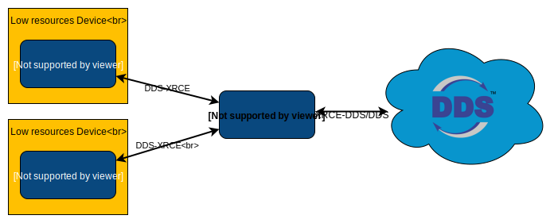

.. _user:

Introduction
============

DDS-XRCE protocol
-----------------

`Micro XRCE-DDS` implements `DDS-XRCE protocol <https://www.omg.org/spec/DDS-XRCE/1.0/Beta1/PDF>`_
specified in the `DDS for eXtremely Resource Constrained Environments` proposal submitted to the `Object Management Group (OMG)` consortium.
This protocol allows to communicate resource constrained clients with a larger `DDS (Data Distribution Service)` network.
This communication is done using a client-server architecture,
where the server (Agent) acts as an intermediary between clients and `DDS Global Data Space`.

`DDS-XRCE protocol` defines a wire protocol between XRCE Agents and XRCE Clients.
This message exchanged revolves around operations and their responses.
XRCE Clients ask the XRCE Agents to run operations and the XRCE Agents reply with the result of those requested operations.
Making use of those operations, XRCE Clients are able to create the DDS entities hierarchy necessary to publish and/or receive data from DDS.
DDS entities are created and stored on the XRCE Agent side so the XRCE Clients can reuse them at will.

`Micro XRCE-DDS` implements the DDS-XRCE protocol using a *Micro XRCE-DDS Agent* as server and providing a C API for developing XRCE Clients.
`Micro XRCE-DDS Agent` uses `Fast RTPS` to reach the DDS Global Data Space.



Fast RTPS
`````````
*eProsima Fast RTPS* is a C++ implementation of the `XRCE-DDS (Real-Time Publish-Subscribe)` protocol,
which provides publisher-subscriber communications over unreliable transports such as UDP,
as defined and maintained by the `OMG` consortium.
XRCE-DDS is also the wire interoperability protocol defined for the `DDS` standard, again by the `OMG`.

For deeper information please refer to the official documentation: `eProsima Fast RTPS <http://eprosima-fast-rtps.readthedocs.io>`_

Operations and entities
-----------------------
*Micro XRCE-DDS* communication between XRCE Client and XRCE Agent is based upon :ref:`operations_label` and responses.
Clients request operations to the Agent.
The Agent will process the received operations and generate responses with the result of these operations.
Clients may process the responses to know how an operations request has ended in the Agent.

*Micro XRCE-DDS Client* can request a variety of operations to the *Micro XRCE-DDS Agent*:

* Create and delete sessions.
* Create and delete entities.
* Write and read Data.

First of all the `Agent` must know about any `Client`.
This is done by sending a `Create session` operation from the `Client` to the `Agent`, which will register the `Client`.
If you do not register the session, all the operations sending to the `Agent` will be refused.
Once registered, the `Client` can request operations to the `Agent`.
The `Client` can create and query entities using operations.
The communication with `DDS` is handled by `Agent` using :ref:`entities_label`.

`Create entity` Operation is the request you use to create entities on the `Agent`.
Each one of these entities corresponds with a `Fast RTPS` object.
The entities you can create are:

* Participants.
* Topics.
* Publisher.
* Subscriber.
* DataWriter.
* DataReader.

For sending and receiving data from/to DDS, `Client` has access to the `DataWriter` and `DataReader` entities.
These entities handle the write/read operations.
For sending and receiving any topic the `Write Data` and `Read Data` operations must be used.

If you want to remove any entity from the `Agent` you can use `Delete entity` operations.
Also, if you want to log out a `Client` session from the `Agent`, you can use the `Delete session` operation.

Topic Type
----------
The data sent by the `Client` to the `DDS Global Data Space` uses the same principles as in `Fast RTPS`.
The `Interface Definition Language (IDL) <https://www.omg.org/spec/IDL/4.2/PDF>`_ is used to define the type and must be known by the client.
Having the type defined as `IDL` we provide the :ref:`micrortpsgen_label` tool.
This tool is able to generate a compatible type that the *Micro XRCE-DDS Client* can use to send and receive.
The type should match the one used on the DDS Side.
