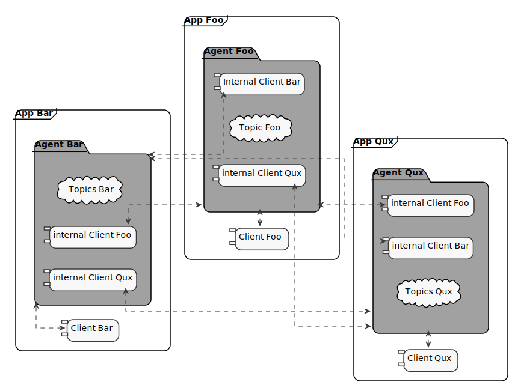

.. _p2p_communication_label:

P2P Communication
=================

This section illustrates the peer-to-peer communication mode offered by *eProsima Micro XRCE-DDS*.
It is organized as follows:

- :ref:`intro_p2p`
- :ref:`pubsub_p2p_example`

.. _intro_p2p:

Introduction
^^^^^^^^^^^^

The peer-to-peer (P2P) mode allows direct communication between applications without DDS,
where by *application* is to be understood the combination of an *Agent* and one or more *Clients*.

In this communication mode, the *Agent* uses the :ref:`CedMiddleware <ced_middleware_label>`.
The *Agent* is in charge of discovering other *External Agents* and create an *Internal Client* for each one of them.
Each *Internal Client* connects to an *External Agent* and subscribes to the set of Topics managed by its own *Agent*.
Thus, a cloud of interconnected *Agents* is created.

Some consideration shall be taken into account in order to use the P2P communication:

#. Only the :code:`create_<entity>_by_ref()` functions shall be used.
#. The Topic's reference represents the name of the Topic.
#. The DataWriter's and DataReader's references need to match the Topic's reference.
#. Publishers and Subscribers have no role.
#. Agents use the CedMiddleware and the Discovery mechanism.

.. _pubsub_p2p_example:

Publish/Subscribe P2P Example
^^^^^^^^^^^^^^^^^^^^^^^^^^^^^

This kind of behaviour can be probed by putting in communication a Publisher P2P application with
a Subscriber P2P application.

Agent with CedMiddleware
------------------------

First of all, install the *Agent* as explained in the :ref:`install_agent` section.
On Linux, this would be: ::

    $ git clone https://github.com/eProsima/Micro-XRCE-DDS-Agent.git
    $ cd Micro-XRCE-DDS-Agent
    $ mkdir build && cd build
    $ cmake ..
    $ make
    $ sudo make install

After having installed the *Agent* system-wide, launch it with the :code:`ced` option activated: ::

    $ ./MicroXRCEAgent udp4 -p <port> -m ced -d

Client P2P publisher app
------------------------

Let's now install the *Client* locally, and with the :code:`-DUCLIENT_BUILD_EXAMPLES=ON` flag enabled, so as
to activate the compilation of the examples. On Linux, this implies running the following: ::

    $ git clone https://github.com/eProsima/Micro-XRCE-DDS-Client.git
    $ cd Micro-XRCE-DDS-Client
    $ mkdir build && cd build
    $ cmake .. -DUCLIENT_BUILD_EXAMPLES=ON
    $ make

At this point, it's possible to launch the :code:`PublishHelloWorldClientP2P` executable
located in the folder :code:`Micro-XRCE-DDS-Client/build/examples/PublishHelloWorldP2P`, which'll make
the *Client* publish in the DDS World the :code:`HelloWorld` topic
(take a look at the IDL defining this topic in the file
:code:`Micro-XRCE-DDS-Client/examples/PublishHelloWorldP2P/HelloWorld.idl`). ::

    $ examples/PublishHelloWorld2P2/PublishHelloWorldClientP2P 127.0.0.1 2019

The source code of the :code:`PublishHelloWorldClientP2P` can be found in
:code:`Micro-XRCE-DDS-Client/examples/PublishHelloWorldP2P/main.c`.

Client P2P subscriber app
-------------------------

After having executed the publisher app, we can launch the :code:`SubscribeHelloWorldClientP2P` excutable,
which is located in the folder :code:`Micro-XRCE-DDS-Client/build/examples/SubscribeHelloWorldP2P`, which'll make
this *Client* subscribe to the same :code:`HelloWorld` topic from the DDS World. ::

    $ examples/SubscriberHelloWorldP2P/SubscribeHelloWorldClientP2P 127.0.0.1 2019

The source code of the :code:`SubscribeHelloWorldClientP2P` can be found in
:code:`Micro-XRCE-DDS-Client/examples/SubscribeHelloWorldP2P/main.c`.

At this point, the subscriber will receive the topics that are being sent by the publisher.
