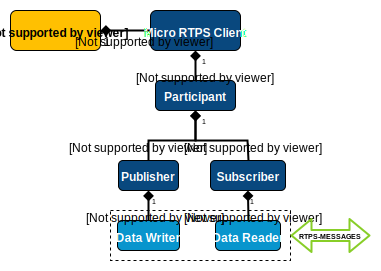

Quick start
===========

*Micro RTPS* provides a C API which allows you to create your own *Micro RTPS Clients* publishing and/or listening to topics from DDS Global Data Space.
The following example how create a simple *Micro RTPS Client* and a *Micro RTPS Agent* for publishing and subscribing to DDS world, using this HelloWorld.idl. ::

    struct HelloWorld
    {
        unsigned long index;
        string message;
    };

First of all, we will start a *Micro RTPS Agent* listening on the same UDP port: ::

    $ cd /usr/local/bin && micrortps_agent udp 127.0.0.1 2018

Along with these *Micro RTPS Agent*, we will create a client that will be publish in DDS World.
(To execute this, you will need the *Micro RTPS* built with the examples) ::

    $ examples/PublishHelloWorld/PublishHelloWorldClient 127.0.0.1 2018

This example is the next one: ::

    #include "HelloWorld.h"

    #include <stdio.h>
    #include <unistd.h>

    void check_and_print_error(Session* session)
    {
        if(session->last_status_received)
        {
            if(session->last_status.status != STATUS_OK)
            {
                printf("%sStatus error (%i)%s\n", "\x1B[1;31m", session->last_status.status, "\x1B[0m");
            }
            else
            {
                //All things go well
            }
        }
        else
        {
            printf("%sConnection error%s\n", "\x1B[1;31m", "\x1B[0m");
        }
    }

    int main(int argc, char** argv)
    {
        if(argc < 3)
        {
            printf("Usage: program agent_ip agent_port\n");
            return 1;
        }

        /* Init session. */
        Session my_session;
        ClientKey key = {{0xBB, 0xBB, 0xCC, 0xDD}};
        uint8_t ip[] = {atoi(strtok(argv[1], ".")), atoi(strtok(NULL, ".")),
                        atoi(strtok(NULL, ".")), atoi(strtok(NULL, "."))};
        uint16_t port = atoi(argv[2]);
        if (!new_udp_session(&my_session, 0x01, key, ip, port, NULL, NULL))
        {
            return 1;
        }

        init_session_sync(&my_session);
        check_and_print_error(&my_session);

        /* Init XRCE objects. */
        ObjectId participant_id = {{0x00, OBJK_PARTICIPANT}};
        create_participant_sync_by_ref(&my_session, participant_id, "default_participant", false, false);
        check_and_print_error(&my_session);

        const char* topic_xml = {"<dds><topic><name>HelloWorldTopic</name><dataType>HelloWorld</dataType></topic></dds>"};
        ObjectId topic_id = {{0x00, OBJK_TOPIC}};
        create_topic_sync_by_xml(&my_session, topic_id, topic_xml, participant_id, false, false);
        check_and_print_error(&my_session);

        const char* publisher_xml = {"<publisher name=\"MyPublisher\""};
        ObjectId publisher_id = {{0x00, OBJK_PUBLISHER}};
        create_publisher_sync_by_xml(&my_session, publisher_id, publisher_xml, participant_id, false, false);
        check_and_print_error(&my_session);

        const char* datawriter_xml = {"<profiles><publisher profile_name=\"default_xrce_publisher_profile\"><topic><kind>NO_KEY</kind><name>HelloWorldTopic</name><dataType>HelloWorld</dataType><historyQos><kind>KEEP_LAST</kind><depth>5</depth></historyQos><durability><kind>TRANSIENT_LOCAL</kind></durability></topic></publisher></profiles>"};
        ObjectId datawriter_id = {{0x00, OBJK_DATAWRITER}};
        create_datawriter_sync_by_xml(&my_session, datawriter_id, datawriter_xml, publisher_id, false, false);
        check_and_print_error(&my_session);

        /* Main loop */
        int32_t count = 0;
        while(true)
        {
            /* Write HelloWorld topic */
            HelloWorld topic = {++count, "Hello DDS world!"};
            write_HelloWorld(&my_session, datawriter_id, STREAMID_BUILTIN_RELIABLE, &topic);
            printf("Send topic: %s, count: %i\n", topic.message, topic.index);

            run_communication(&my_session);

            sleep(1);
        }

        close_session_sync(&my_session);

        return 0;
    }

For seeing the messages from the DDS Global Data Space point of view, you can use *Fast RTPS* HelloWorld example running a subscriber (`Fast RTPS HelloWorld <http://eprosima-fast-rtps.readthedocs.io/en/latest/introduction.html#building-your-first-application>`_): ::

    $ cd /usr/local/examples/C++/HelloWorldExample
    $ sudo make && cd bin
    $ ./HelloWorldExample subscriber

This example shows how a *Micro RTPS Client* publishes messages on a DDS Global Data Space. You need to create different kind of entities on a *Micro RTPS Agent* using Operations requests sent by *Micro RTPS Client*.

The following figure represents the hierarchy of objects you need to instantiate on the *Micro RTPS Agent* to publish on a topic:

Learn More
----------

To learn more about DDS and FastRTPS: `eProsima Fast RTPS <http://eprosima-fast-rtps.readthedocs.io>`_

To learn how to install *Micro RTPS* read: :ref:`sources_label`

To learn more about *Micro RTPS* read :ref:`user`

To learn more about *Micro RTPS Gen* read: :ref:`micrortpsgen_label`

