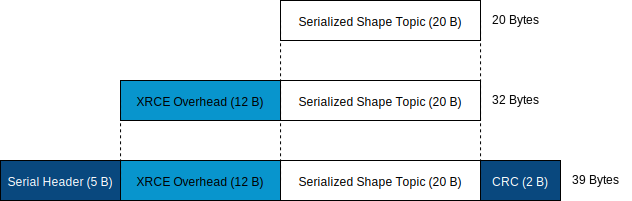

.. _transport_label:

Transport
=========

This section shows how the transport layer is implemented in both *eProsima Micro XRCE-DDS Agent* and *eProsima Micro XRCE-DDS Client*.
Furthermore, this section describes how to add your custom transport in *eProsima Micro XRCE-DDS*.
It is organized as follows:

- :ref:`intro_transport`
- :ref:`agent_transport_architecture`
- :ref:`client_transport_architecture`
- :ref:`stream_framing_label`
- :ref:`custom_transport`

.. _intro_transport:

Introduction
------------

In contrast to other IoT middlewares such as MQTT and CoaP, which work over a particular transport protocol, the DDS-XRCE protocol is designed to support multiple transport protocols natively.
This feature of DDS-XRCE is enhanced by *eProsima Micro XRCE-DDS* in two ways.
On the one hand, the logic of both the *Agent* and the *Client* is completely separated from the transport protocol underneath through a set of interfaces, which will be explained in the following sections.

On the other hand, taking advantage of the transport interface flexibility, the Client comes with a framing protocol implemented that enables using the DDS-XRCE wire protocol over stream-oriented transports.
This feature allows using *eProsima Micro XRCE-DDS* over two kinds of transports layers:

* **Packet-oriented transports**: communication protocols that allow sending whole packets.
* **Stream-oriented transports**: communication protocols that follow a stream logic.

.. _agent_transport_architecture:

Agent Transport Architecture
----------------------------

The *Agent* transport architecture is composed by 3 different layers:

.. image:: images/agent_transport_stack.svg

* **Server Layer**: is an interface from which each transport-specific server inherits.
  This interface implements four different threads:

  * *Sender thread*: in charge of sending the messages to the *Clients*.
  * *Receiver thread*: in charge of receiving the messages from the *Clients*.
  * *Processing thread*: in charge of processing the messages received from the *Clients*.
  * *Heartbeat thread* in charge of handling reliability with the *Clients*.

* **Transport Layer**: is a transport-specific class which manages the sessions established between the *Agent* and the *Clients*. This class inherits from the *Server* interface.
* **Platform Layer**: is a platform-specific class which implements the sending and receiving functions for a given transport in a given platform. It should be noted that it is the only class that has platform dependencies.

UDP Server Example
^^^^^^^^^^^^^^^^^^

As an example, this subsection describes how the UDP server is implemented in *eProsima Micro XRCE-DDS Agent*.
The figure below shows the *Agent* transport architecture for the UDP servers.

.. image:: images/agent_transport_architecture.svg

At the top of this architecture, there is a ``Server`` interface (Server Layer).
This ``Server`` interface has the following pure virtual functions:

.. code-block:: cpp

    /* Transport Layer */
    virtual void on_create_client(EndPoint* source, const dds::xrce::ClientKey& client_key) = 0;
    virtual void on_delete_client(EndPoint* source) = 0;
    virtual const dds::xrce::ClientKey get_client_key(EndPoint* source) = 0;
    virtual std::unique_ptr<EndPoint> get_source(const dds::xrce::ClientKey& client_key) = 0;

    /* Platform Layer */
    virtual bool init() = 0;
    virtual bool close() = 0;
    virtual bool recv_message(InputPacket& input_packet, int timeout) = 0;
    virtual bool send_message(OutputPacket output_packet) = 0;
    virtual int get_error() = 0;

The first four virtual functions are transport specific (Transport Layer).
These functions are overridden by the ``UDPServerBase`` class, which is in charge of managing the sessions between *Clients* and the *Agent*.

On the other hand, the last five virtual functions are platform specific (Platform Layer).
These functions are override by the ``UDPServerLinux`` and ``UDPServerWindows`` for Linux and Windows systems, respectively.

.. _client_transport_architecture:

Client Transport Architecture
-----------------------------

The *Client* transport architecture is analogous to the *Agent* architecture.
There are also three different layers, but instead of the Server Layer, there is a Session Layer.

.. image:: images/client_transport_stack.svg

* **Session Layer**: implements the XRCE protocol logic, and it only knows about sending and receiving messages.
* **Transport Layer**: implements the sending and receiving **message functions** for each transport protocol, calling to the Platform Layer functions.
  This layer only knows about sending and receiving messages through a given transport protocol.
* **Platform Layer**: implements the sending and receiving **data functions** for each platform.
  This layer only knows about sending and receiving raw data through a given transport in a given platform.

UDP Transport Example
^^^^^^^^^^^^^^^^^^^^^

As an example, this subsection describes how the UDP transport is implemented in *eProsima Micro XRCE-DDS Client*.
The figure below shows the *Client* transport architecture for UDP transport.

Similar to the *Agent* architecture, there is also an interface, ``uxrCommunication``, whose function pointers are used from the Session Layer.
That is, each time a ``run_session`` is called, the Session Layer calls to ``send_msg_func`` and ``recv_msg_func`` without worrying about the transport protocol or the platform in use.
This struct has the following function pointers:

.. code-block:: c

    bool send_msg_func(void* instance, const uint8_t* buf, size_t len);
    bool recv_msg_func(void* instance, uint8_t** buf, size_t* len, int timeout);
    uint8_t comm_error_func(void);

These functions are implemented by the ``uxrUDPTransport``, which is in charge of two main tasks:

1. Provide an implementation for the communication interface functions.
   For example, in the case of the UDP protocol, these functions are the following:

.. code-block:: c

    bool send_udp_msg(void* instance, const uint8_t* buf, size_t len);
    bool recv_udp_msg(void* instance, uint8_t** buf, size_t* len, int timeout);
    uint8_t get_udp_error(void);

2. Offer to the user the initialization and close functions related to the transport protocol.
   For example, in the case of the UDP protocol, these functions are the following:

.. code-block:: c

    bool uxr_init_udp_transport(uxrUDPTransport* transport, const char* ip, uint8_t port);
    bool uxr_close_udp_transport(uxrUDPTransport* transport);

For each platform, there is an implementation of these functions defined in the Transport Layer interface.
For example, in the case of Linux under UDP transport protocol, the ``uxrUDPPlatform`` implements the following functions:

.. code-block:: c

    bool uxr_init_udp_platform(uxrUDPPlatform* platform, const char* ip, uint16_t port);
    bool uxr_close_udp_platform(uxrUDPPlatform* platform);
    size_t uxr_write_udp_data_platform(uxrUDPPlatform* platform, const uint8_t* buf, size_t len, uint8_t* errcode);
    size_t uxr_read_udp_data_platform(uxrUDPPlatform* platform, uint8_t* buf, size_t len, int timeout, uint8_t* errcode);

.. _stream_framing_label:

Stream Framing Protocol
-----------------------

*eProsima Micro XRCE-DDS* has a **Stream Framing Protocol** with the following features:

* **HDLC Framing**: each frame begins with a ``begin_frame`` octet ``(0x7E)``, and the rest of the frame undergoes byte stuffing, using the ``space`` octet ``(0x7D)`` followed by the original octet exclusive-or with ``0x20``.
  For example, if the frame contains the octet `0x7E`, it is encoded as `0x7D, 0x5E`; and the same for the octet `0x7D` which is encoded as `0x7D, 0x5D`.
* **CRC Calculation**: frames end with the CRC-16 for detecting frame corruption.
  The CRC-16 is computed using the polynomial ``x^16 + x^12 + x^5 + 1`` after the frame stuffing for each octet of the frame and including the ``begin_frame``, as it is described in the `RFC 1662 <https://tools.ietf.org/html/rfc1662>`_ (see sec. C.2).
* **Routing header**: the Stream Framing Protocol provides ``source`` and ``remote`` addresses in the framing, which can be used to implement a routing protocol.

All the previous features are addressed using the following frame format: ::

    0        8        16       24                40                 X                X+16
    +--------+--------+--------+--------+--------+--------//--------+--------+--------+
    |  FLAG  |  SADD  |  RADD  |       LEN       |      PAYLOAD     |       CRC       |
    +--------+--------+--------+--------+--------+--------//--------+--------+--------+

* ``FLAG``: is a ``begin_frame`` octet for frame initialization.
* ``SADD``: is the address of the device which sent the message, that is, the ``source`` address.
* ``RADD``: is the address of the device which should receive the message, that is, the ``remote`` address.
* ``LEN``: is the length of the **payload without framing**. It is encoded as a 2-bytes array in little-endian.
* ``PAYLOAD``: is the payload of the message.
* ``CRC``: is the CRC of the message **after the stuffing**.

Data Sending
^^^^^^^^^^^^

The figure below shows the workflow of the data sending.
This workflow could be divided into the following steps:

    1. A publisher application calls the *Client* library to send a given topic.
    2. The *Client* library serializes the topic inside an XRCE message using *Micro CDR*.
       As a result, the XRCE message with the topic is stored in an **Output Stream Buffer**.
    3. The *Client* library calls the Stream Framing Protocol to send the serialized message.
    4. The Stream Transport frames the message, that is, it adds the header, the payload, and CRC of the frame, taking into account the stuffing.
       This step takes place in an auxiliary buffer called **Framing Buffer**.
    5. Each time the Framing Buffer is full, the data is flushed into the **Device Buffer**, calling the writing system function.

This approach has some advantages which should be pointed out:

    1. The HDLD framing and the CRC control provide **integrity** and **security** to the Stream Framing.
    2. The framing technique allows to **reduce memory usage**.
       The reason is that the Framing Buffer size (42 bytes) bounds the Device Buffer size.
    3. The framing technique also allows sending **large data** over stream-oriented transports.
       The reason is that the message size is not bounded by the Device Buffer size, since the message is fragmented and has undergone byte stuffing during the framing stage.

Data Receiving
^^^^^^^^^^^^^^

The workflow of the data receiving is analogous to the data sending workflow:

    1. A subscriber application calls the *Client* library to receive a given topic.
    2. The *Client* library calls the Stream Framing Protocol to receive the stream message.
    3. The Stream Framing Protocol reads data from the **Device Buffer** and unframes the raw data received from the Device Buffer in the **Unframing Buffer**.
    4. Once the Unframing Buffer is full, the Stream Framing Protocol appends the fragment into the **Input Stream Buffer**.
       This operation is repeated until a complete message is received.
    5. The *Client* library deserializes the topic from the Input Stream Buffer to the user topic struct.

.. image:: images/serial_transport_receiving.svg

It should point out that this approach has the same advantages that the sending one.

Shapes Topic Example
^^^^^^^^^^^^^^^^^^^^

This subsection shows how a **Shapes Topic**, defined by the IDL below, is packed into the Serial Transport.

::

    typedef struct ShapeType
    {
        char color[128];
        int32_t x;
        int32_t y;
        int32_t shapesize;
    } ShapeType;

    ShapeType topic = {"red", 11, 11, 89};

In Serial Transport, the topic's packaging could be divided into two steps:

    1. The Session Layer adds the XRCE header and subheader.
       It adds an overhead of 12 bytes to the topic.
    2. The Serial Transport adds the serial header, CRC and stuffing the payload.
       In the best case, it adds an overhead of 7 bytes to the topic.

The figure above shows the overhead added by Serial Transport.
In the best case, it is **only 19 bytes**, but it should be noted that, in this example, the message stuffing has been neglected.

.. _custom_transport:

Custom Transport
----------------

*eProsima Micro XRCE-DDS* provides a user API that allows interfacing with the lowest level transport layer at runtime,
which enables users to implement their own transports in both the *Client* and *Agent* libraries.
Thanks to this, the Micro XRCE-DDS wire protocol can be transmitted over virtually any protocol, network or communication
mechanism. In order to do so, two general communication modes are provided:

* **Stream-oriented mode**: the communication mechanism implemented does not have the concept of packet. 
  HDLC framing (:ref:`stream_framing_label`) will be used.
* **Packet-oriented mode**: the communication mechanism implemented is able to send a whole packet that includes an XRCE message.

These two modes can be selected by activating and deactivating the :code:`framing` parameter in both the *Client* and the *Agent* functions.

The relevant API can be found in the :ref:`transport_api` section of the :ref:`client_api_label`.

Micro XRCE-DDS Client
^^^^^^^^^^^^^^^^^^^^^

In order to enable the *eProsima Micro XRCE-DDS Client* profile for custom transports, the CMake argument 
``UCLIENT_PROFILE_CUSTOM_TRANSPORT=<bool>`` must be set to true. By doing so, the user will enable the functionality for setting
the transport-related callbacks explained in the :ref:`transport_api` section of the :ref:`client_api_label`.

An example on how to set these external transport callbacks in the *Client* API is:

.. code-block:: c

    uxrCustomTransport transport;
    uxr_set_custom_transport_callbacks(
        &transport,
        true, // Framing enabled here. Using Stream-oriented mode.
        my_custom_transport_open,
        my_custom_transport_close,
        my_custom_transport_write,
        my_custom_transport_read);

    struct custom_args {
        ...
    }
    
    struct custom_args args;

    if(!uxr_init_custom_transport(&transport, (void *) &args))
    {
        printf("Error at create transport.\n");
        return 1;
    }

It is important to notice that in :code:`uxr_init_custom_transport` a pointer to custom arguments is set. This reference will be copied to
the :code:`uxrCustomTransport` and will be available to every callbacks call.

In general, four functions need to be implemented. The behavior of these functions is sightly different, depending on the selected mode:

Open function
    .. code-block:: c
    
        bool my_custom_transport_open(uxrCustomTransport* transport)
        {
            ...
        }

    This function should open and init the custom transport. It returns a boolean indicating if the opening was successful.

    :code:`transport->args` have the arguments passed through :code:`uxr_init_custom_transport`.

Close function
    .. code-block:: c
    
        bool my_custom_transport_close(uxrCustomTransport* transport)
        {
            ...
        }
    
    This function should close the custom transport. It returns a boolean indicating if closing was successful.
   
    :code:`transport->args` have the arguments passed through :code:`uxr_init_custom_transport`.

Write function
    .. code-block:: c
    
        size_t my_custom_transport_write(
                uxrCustomTransport* transport,
                const uint8_t* buffer,
                size_t length,
                uint8_t* errcode)
        {
            ...
        }

    This function should write data to the custom transport. It returns the number of Bytes written.

    :code:`transport->args` have the arguments passed through :code:`uxr_init_custom_transport`.

    * **Stream-oriented mode:** The function can send up to :code:`length` Bytes from :code:`buffer`.

    * **Packet-oriented mode:** The function should send :code:`length` Bytes from :code:`buffer`.
      If less than :code:`length` Bytes are written :code:`errcode` can be set.

Read function
    .. code-block:: c
    
        size_t my_custom_transport_read(
                uxrCustomTransport* transport,
                uint8_t* buffer,
                size_t length,
                int timeout,
                uint8_t* errcode)
        {
            ...
        }

    This function should read data to the custom transport. It returns the number of Bytes read

    :code:`transport->args` have the arguments passed through :code:`uxr_init_custom_transport`.

    * **Stream-oriented mode:** The function should retrieve up to :code:`length` Bytes from transport
      and write them into :code:`buffer` in :code:`timeout` milliseconds.

    * **Packet-oriented mode:** The function should retrieve :code:`length` Bytes from transport
      and write them into :code:`buffer` in :code:`timeout` milliseconds. If less than :code:`length` Bytes are read :code:`errcode` can be set.

Micro XRCE-DDS Agent
^^^^^^^^^^^^^^^^^^^^^

The *eProsima Micro XRCE-DDS Agent* profile for custom transports is enabled by default.

An example on how to set the external transport callbacks in the Micro XRCE-DDS Agent API is:

.. code-block:: cpp

    eprosima::uxr::Middleware::Kind mw_kind(eprosima::uxr::Middleware::Kind::FASTDDS);
    eprosima::uxr::CustomEndPoint custom_endpoint;

    // Add transport endpoing parameters
    custom_endpoint.add_member<uint32_t>("param1");
    custom_endpoint.add_member<uint16_t>("param2");
    custom_endpoint.add_member<std::string>("param3");

    eprosima::uxr::CustomAgent custom_agent(
        "my_custom_transport",
        &custom_endpoint,
        mw_kind,
        true, // Framing enabled here. Using Stream-oriented mode.
        my_custom_transport_open,
        my_custom_transport_close,
        my_custom_transport_write
        my_custom_transport_read);

    custom_agent.start();

*CustomEndPoint*
****************

The :code:`custom_endpoint` is an object of type `eprosima::uxr::CustomEndPoint` and it us in charge of handling the endpoint parameters. The *Agent*, unlike the *Client*, can receive
messages from multiple *Clients* so it must be able to differentiate between them.
Therefore, the :code:`eprosima::uxr::CustomEndPoint` should be provided with information about the origin of the message
in the read callback, and with information about the destination of the message in the write callback.

In general, the members of a :code:`eprosima::uxr::CustomEndPoint` object can be unsigned integers and strings.

`CustomEndPoint` defines three methods:

Add member
    .. code-block:: cpp

        bool eprosima::uxr::CustomEndPoint::add_member<*KIND*>(const std::string& member_name);

    Allows to dynamically add a new member to the endpoint definition.

    Returns `true` if member was correctly added, or `false` if something went wrong (for example, the member already existed).

    :KIND: To be chosen from: ``uint8_t``, ``uint16_t``, ``uint32_t``, ``uint64_t``, ``uint128_t`` or ``std::string``.
    :member_name: The tag used to identify the endpoint member.

Set member value
    .. code-block:: cpp

        void eprosima::uxr::CustomEndPoint::set_member_value(const std::string& member_name, const *KIND* & value);

    Sets the specific value (numeric or string) for a certain member, which must previously exist in the ``CustomEndPoint``.

    :member_name: The member whose value is going to be modified.
    :value: The value to be set, of `KIND`: ``uint8_t``, ``uint16_t``, ``uint32_t``, ``uint64_t``, ``uint128_t`` or ``std::string``.

Get member
    .. code-block:: cpp

        const *KIND* & eprosima::uxr::CustomEndPoint::get_member(const std::string& member_name);

    Gets the current value of the member registered with the given parameter.
    The retrieved value might be an ``uint8_t``, ``uint16_t``, ``uint32_t``, ``uint64_t``, ``uint128_t`` or ``std::string``.

    :member_name: The `CustomEndPoint` member name whose current value is requested.

*CustomAgent user-defined methods*
**********************************

As in the *Client* API, four functions should be implemented. The behaviour of these functions is sightly different
depending on the selected mode:

Open function
    .. code-block:: cpp

        eprosima::uxr::CustomAgent::InitFunction my_custom_transport_open = [&]() -> bool
        {
            ...
        }

    This function should open and init the custom transport. It returns a boolean indicating if the opening was successful.

Close function
    .. code-block:: cpp

        eprosima::uxr::CustomAgent::FiniFunction my_custom_transport_close = [&]() -> bool
        {
            ...
        }

    This function should close the custom transport. It returns a boolean indicating if the closing was successful.

Write function
    .. code-block:: cpp

        eprosima::uxr::CustomAgent::SendMsgFunction my_custom_transport_write = [&](
            const eprosima::uxr::CustomEndPoint* destination_endpoint,
            uint8_t* buffer,
            size_t length,
            eprosima::uxr::TransportRc& transport_rc) -> ssize_t
        {
            ...
        }

    This function should write data to the custom transport. It must use
    the :code:`destination_endpoint` members to set the data destination. It returns the number of Bytes written.
    It should set :code:`transport_rc` indicating the result of the operation.

    * **Stream-oriented mode:** The function can send up to :code:`length` Bytes from :code:`buffer`.

    * **Packet-oriented mode:** The function should send :code:`length` Bytes from :code:`buffer`. If less than :code:`length` Bytes are written, :code:`transport_rc` can be set.

Read function
    .. code-block:: cpp

        eprosima::uxr::CustomAgent::RecvMsgFunction my_custom_transport_read = [&](
                eprosima::uxr::CustomEndPoint* source_endpoint,
                uint8_t* buffer,
                size_t length,
                int timeout,
                eprosima::uxr::TransportRc& transport_rc) -> ssize_t
        {
            ...
        }

    This function should read data to the custom transport. It must fill :code:`source_endpoint` members with data source.
    It returns the number of Bytes read.
    It should set :code:`transport_rc` indicating the result of the operation.

    * **Stream-oriented mode:** The function should retrieve up to :code:`length` Bytes from transport
      and write them into :code:`buffer` in :code:`timeout` milliseconds.

    * **Packet-oriented mode:** The function should retrieve :code:`length` Bytes from transport
      and write them into :code:`buffer` in :code:`timeout` milliseconds. If less than :code:`length` Bytes are read transport_rc can be set.
