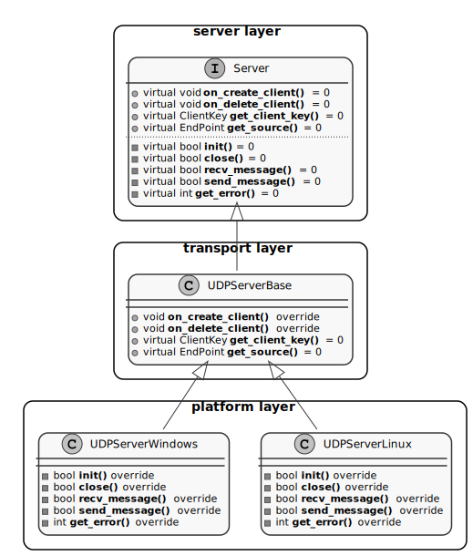

.. _transport_label:

Transport
=========
This section shows how the transport layer is implemented in both *eProsima Micro XRCE-DDS Agent* and *eProsima Micro-DDS Client*.
Furthermore, this section describes how to add your own custom transport in *eProsima Micro XRCE-DDS*.

Introduction
------------
In contract to other IoT middleware such as MQTT and CoaP which work over a particular transport protocol, the XRCE protocol is design to support multiple transport protocol natively.
This feature of XRCE is enhanced by *eProsima Micro XRCE-DDS* in two ways.
On the one hand, both *Agent* and *Client* have the logic of the protocol complete separate from the transport protocol through a set of interfaces, which will be explained in the following sections.
On the other hand, taking advantage of the transport interface flexibility, one custom Serial Transport has been implemented in order to provide support to serial communication.

Agent Transport Architecture
----------------------------
The above figure shows the *Agent* transport architecture.
There is an interface ``Server`` which each transport protocol shall implement.
For each kind of transport protocol, there is a class which is in charge of managing the sessions with the *Client*.
It class implement the following virtual function from the ``Server`` interface::

    void on_create_client(EndPoint* source, const dds::xrce::CLIENT_Representation& representation);
    void on_delete_client(EndPoint* source);

These functions are call each time a session is established or remove with a *Client*.
As an example of how these functions behave, they update set of ``std::map`` which relate the source address of the *Client* with its ``ClientKey``.

For each kind of platform (Windows, Linux, MacOS, etc.), there is a class which implements the following functions of the ``Server`` interface: ::

    bool init();
    bool close();
    bool recv_message(InputPacket& input_packet, int timeout);
    bool send_message(OutputPacket output_packet);
    int get_error();

How to add support for a new platform?
^^^^^^^^^^^^^^^^^^^^^^^^^^^^^^^^^^^^^^
Take into account the aforementioned, the adaptation of an already implemented transport protocol to a new platform is straightforward, only the five functions described above shall be implemented.

How to add a new transport?
^^^^^^^^^^^^^^^^^^^^^^^^^^^
On the other hand, for adding a new kind of transport protocol both set of functions shall be implemented, the session management functions and the transport functions.

Client Transport Architecture
-----------------------------
The above figure shows the *Client* transport architecture.
In these case, there is also an interface, ``uxrCommunication``, which functions are call from the session layer.
That is, each time the session wants to send or receive a message form the *Agent* it is going to call to these functions ::

    bool send_msg_func(void* instance, const uint8_t* buf, size_t len);
    bool recv_msg_func(void* instance, uint8_t** buf, size_t* len, int timeout);
    uint8_t comm_error_func(void);

The transport layer interface, ``uxrUDPTransport``, is in charge of two main tasks: 

1. Override the communication interface functions. 
   For example, in the case of the UDP protocol these functions are the followings: ::
   
    bool send_udp_msg(void* instance, const uint8_t* buf, size_t len);
    bool recv_udp_msg(void* instance, uint8_t** buf, size_t* len, int timeout);
    uint8_t get_udp_error(void);

2. Offer to the user the initialization and close function related with the transport protocol.
   For example, in the case of the UDP protocol these functions are the followings: ::

    bool uxr_init_udp_transport(uxrUDPTransport* transport, uxrUDPPlatform* platform, const char* ip, uint8_t port);
    bool uxr_close_udp_transport(uxrUDPTransport* transport);

For each platform there is an implementation of the virtual functions defined in the transport layer interface.
For example, in the case of Linux under UDP transport protocol, the ``uxrUDPPlatform`` implement the following functions: ::

    bool uxr_init_udp_platform(uxrUDPPlatform* platform, const char* ip, uint16_t port);
    bool uxr_close_udp_platform(uxrUDPPlatform* platform);
    size_t uxr_write_udp_data_platform(uxrUDPPlatform* platform, const uint8_t* buf, size_t len, uint8_t* errcode);
    size_t uxr_read_udp_data_platform(uxrUDPPlatform* platform, uint8_t* buf, size_t len, int timeout, uint8_t* errcode);

.. image:: images/client_transport_architecture.svg

Custom Transport
^^^^^^^^^^^^^^^^

Taking into account the aforementioned, the adaptation of an already implemented transport protocol for a new platform is straightforward. 
It is enough to implement the virtual function of the transport layer.
For example, in the case of UDP there are: ::

    bool uxr_init_udp_platform(uxrUDPPlatform* platform, const char* ip, uint16_t port);
    bool uxr_close_udp_platform(uxrUDPPlatform* platform);
    size_t uxr_write_udp_data_platform(uxrUDPPlatform* platform, const uint8_t* buf, size_t len, uint8_t* errcode);
    size_t uxr_read_udp_data_platform(uxrUDPPlatform* platform, uint8_t* buf, size_t len, int timeout, uint8_t* errcode);
    

Custom Serial Transport
-----------------------

The Custom Serial Transport implemented in *eProsima Micro XRCE-DDS* is inspired by the `PPP protocol <https://tools.ietf.org/html/rfc1662>`_. ::

    0        8        16       24                40                 X                X+16
    +--------+--------+--------+--------+--------+--------//--------+--------+--------+
    |  FLAG  |  SADD  |  RADD  |       LEN       |      PAYLOAD     |       CRC       |
    +--------+--------+--------+--------+--------+--------//--------+--------+--------+

* ``FLAG``: is the flag of message initialization ...
* ``SADD``: is the source address of the device which sent the message ...
* ``RADD``: is the remote address of the device to which the message should be addressed ...
* ``LEN``: is the length of the **payload with framing** ...
* ``PAYLOAD``: is the payload of the message **with framing** ...
* ``CRC``: is the CRC of the message **with the framing** ...
